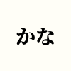

<p align="center">
  
</p>

<h1 align="center">Kana</h1>

<p align="center">
  [<a href="https://kana.ayaka.io">Try it</a>]
</p>

Kana is a simple and lightweight web-based application that allows you to practice your Japanese kana reading skills.

> Heavily inspired by [Study | Real Kana](https://www.realkana.com/study)

## Development

```shell
pnpm i
```

```shell
pnpm dev
```
